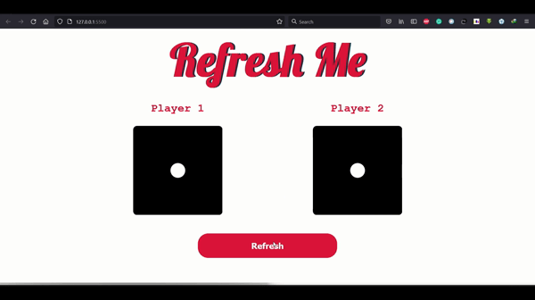

# DICE GAME

A JavaScript Mini project using HTML, CSS.

## Project Preview



## Lessons Learned

What I learned on this mini-project.

### querySelector & querySelectorAll

```javascript
var h1 = document.querySelector("h1");
var img1 = document.querySelectorAll("img");
var button = document.querySelector("button");
```

This will return the HTML element h1, img & button.

### addEventListener

```javascript
button.addEventListener("click", changeText);
```

It is an event listener that fires when a user clicks the Refresh button.

### setAttribute

```javascript
img1.setAttribute("src", randomImgSource1);
```

Sets the value of src attribute on the img1 element.

### Math Function

```javascript
var randomNumber1 = Math.floor(Math.random() * 6) + 1;
```

This is used to generate random number from 1 to 6.
